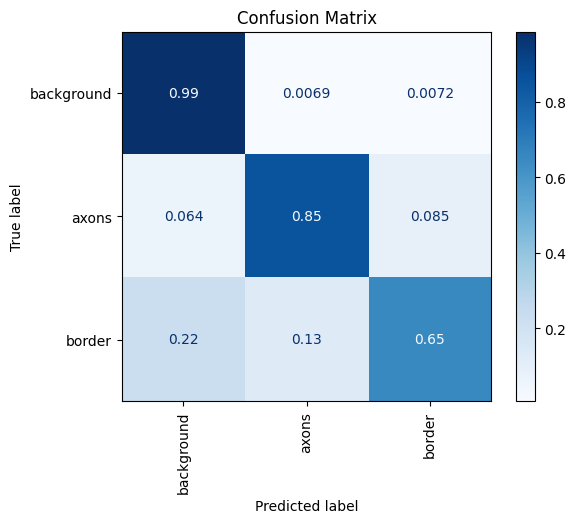
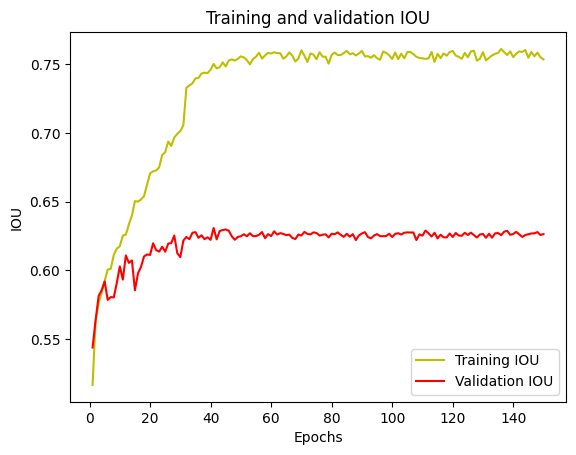
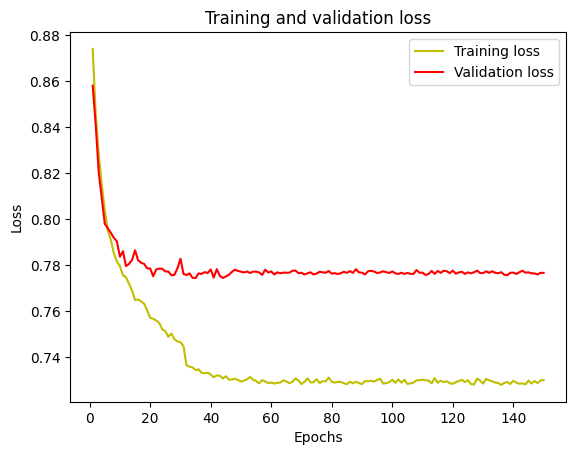

# **3D-Unet Directory**

This directory contains the necessary files and outputs for the 3D-Unet model used in the pipeline.

---

## **Contents**

### **1. Model Files**
- **Split Model Parts**:
  - The trained model is stored as split files (`part_*`) due to its large size.
  - **Reassemble the Model**:
    - Navigate to the `model/` directory.
    - Use the following command in Git Bash to reassemble the model:
      ```bash
      cat part_* > model.h5
      ```
    - The reassembled file, `model.h5`, can then be used for inference or further training.

### **2. Evaluation Outputs**
- **Plots**:
  - **Confusion Matrix**:
    - Visualizes the performance of the model across all classes.
    
  - **IOU Plot**:
    - Shows training and validation IOU scores over epochs.
    

  - **Loss Plot**:
    - Displays training and validation loss over epochs.
    

---

## **Contact**

For further questions or assistance, please contact:  
**Ding Yang Wang**  
[deweywang2000@gmail.com](mailto:deweywang2000@gmail.com)
